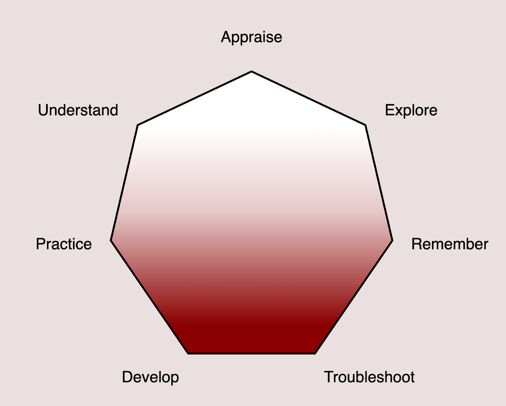

# O que é "Documentação"?

Uma [pesquisa do GitHub de 2017](https://opensourcesurvey.org/2017/) com 5500 usuários e desenvolvedores concluiu que
entre os respondentes, a distribuição de gênero era:
- 95% homens
- 3% mulheres
- 1% pessoas não-binárias

Na mesma pesquisa do GitHub, 93% dos colaboradores relataram que a documentação incompleta ou desatualizada é um
problema, mas 60% disseram que raramente/nunca contribuem para a documentação.

(Fonte: _Geiger, R.S., Varoquaux, N., Mazel-Cabasse, C. et al. The Types, Roles, and Practices of Documentation in Data Analytics Open Source Software Libraries_)

## Pra que serve documentação?

- Para documentar decisões técnicas
- Para explicar a lógica do código
- Para comunicar a estrutura de governança
- Para definir o tom do projeto
- Para ensinar um conceito, ideia ou fluxo de trabalho
- Para integrar novas pessoas
- Para comunicar notícias, eventos, anúncios
- **Para alcançar outras pessoas**

## Escrita técnica (_technical writing_)

Escrita técnica é a prática de comunicar informações complexas de forma clara e concisa. Ao contrário da escrita criativa, seu conteúdo costuma ser sucinto e direto ao ponto. Seu objetivo é ajudar um público específico a entender um produto, processo ou conceito para que possam concluir uma tarefa, tomar uma decisão ou aprender algo novo. Exemplos incluem manuais do usuário, guias de instruções, relatórios técnicos e documentação de software.

Para software, a escrita técnica pode incluir:
- Documentos narrativos: tutoriais, guias práticos, guias passo-a-passo, livros
- Docstrings, comentários de código, revisão de código (em pull requests, por exemplo)
- RFC, propostas, especificações técnicas
- Vídeos, palestras, slides
- Comunicações, redes sociais
- Processos internos, manuais

Parte do processo inclui saber quem é seu público, em que nível cada documento deve ser escrito, qual linguagem usar e, se possível, obter feedback (e agir de acordo).

### "Docs as code"

Do ponto de vista de um usuário, se um recurso não está documentado, então ele não existe, e se um recurso está documentado incorretamente, então ele está quebrado.

Docs as code é uma filosofia que recomenda “escrever documentação com as mesmas ferramentas e fluxos de trabalho que seu código.” (Saiba mais: https://www.writethedocs.org/guide/docs-as-code/) Um ponto de vista ainda mais radical é o [DDD (Docs-driven development)](https://www.youtube.com/watch?v=31Uhdd1efYA)

De qualquer maneira, a documentação deve ser tratada como parte integrante do projeto de software, e não como um acessório ou reflexão tardia.

## Arquitetura da documentação

Existem muitas maneiras de organizar um conjunto de documentação. O mais importante é garantir que a estrutura faça
sentido para o público-alvo e facilite a navegação.

Tenha em mente que as pessoas gostam de ler as páginas de documentação "na diagonal" - ou seja, elas podem não ler tudo,
mas vão procurar as informações mais relevantes. Por isso, selecionar informações é importante - o escritor tem a
responsabilidade de **sinalizar** o que é importante.

Sempre que puder, use títulos e subtítulos claros, listas com marcadores, tabelas e imagens para facilitar a leitura. Se
o seu site permitir o uso de um motor de busca, certifique-se de que ele funcione bem.

### Diatáxis

https://diataxis.fr/

Organiza a documentação em quatro categorias:
- Tutoriais: instruções passo-a-passo para alcançar um objetivo específico
- Guias práticos (how-to guides): instruções para realizar tarefas específicas
- Referência: documentação detalhada sobre APIs, comandos, configurações
- Conceitos: explicações sobre ideias, princípios e arquitetura

### EPPO

Em um contexto de documentação, em que os leitores chegam à maioria das páginas por um motor de busca, _toda página é a "página um"_ (Every Page is Page One) https://everypageispageone.com/the-book/

Uma das ideias centrais do EPPO é que os leitores não seguem uma ordem linear ao ler a documentação. Eles chegam a uma página específica com uma pergunta ou problema em mente e esperam encontrar a resposta rapidamente. Além disso, os leitores precisam poder acessar outras áreas da documentação a partir dali, caso precisem de mais contexto ou informações adicionais.

### Seven-action documentation model

O modelo de documentação de sete ações (https://passo.uno/seven-action-model/) propõe que a documentação deve ser estruturada para atender a sete ações principais que os usuários podem realizar:

### Documentação viva

Um conjunto de documentação é vivo, e deve evoluir junto com o software e a comunidade que o utiliza. Algumas práticas recomendadas para manter a documentação viva incluem:
- Atualizações regulares;
- Reproducibilidade/documentação interativa;
- Fomentar uma cultura de documentação no time;
- Usar ferramentas como doctests.

#### Versionar documentação?

Num contexto de documentação viva, faz sentido versionar a documentação junto com o código-fonte do software. Isso garante que a documentação esteja sempre alinhada com a versão atual do software, evitando confusões e inconsistências.

### Traduções

Se o seu projeto tem uma comunidade internacional, considere traduzir a documentação para outros idiomas. Isso pode aumentar significativamente o alcance e a acessibilidade do seu projeto.

## O elefante na sala: documentação feita por IA

A documentação feita inteiramente por IA apresenta informações erradas, incompletas, envenenadas ou sem sentido. Elas podem ser uma imensa distração e levar o leitor ao erro.

Por outro lado, ferramentas de IA podem ser úteis para resumir informações e fornecer um ponto de partida rápido. Elas podem ajudar a indexar informações e identificar padrões.

**Nunca confie inteiramente em ferramentas de IA** e certifique-se de ser transparente com seus leitores.

Esteja ciente das limitações dessas ferramentas e como elas podem criar confusão e até conflito.

Desenvolva uma política e concorde com uma abordagem com sua equipe.
