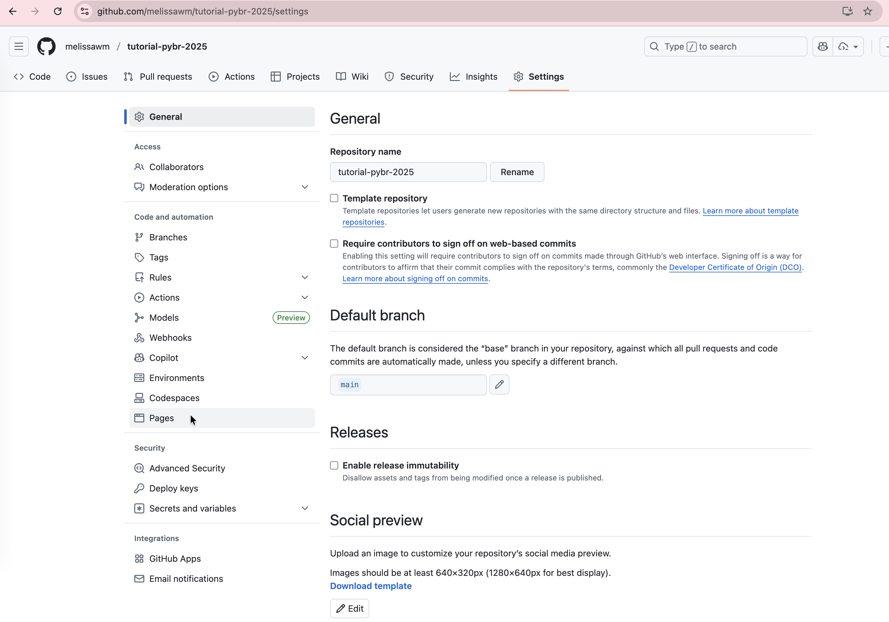
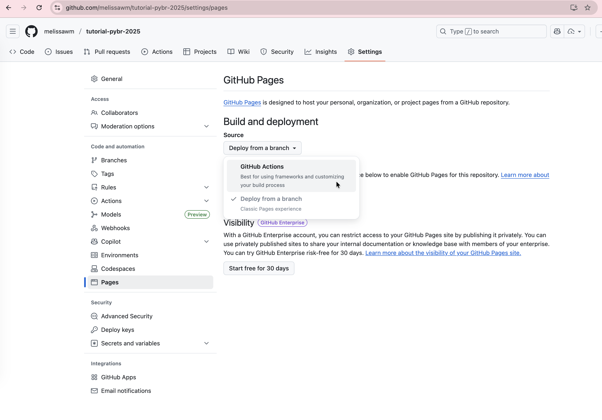
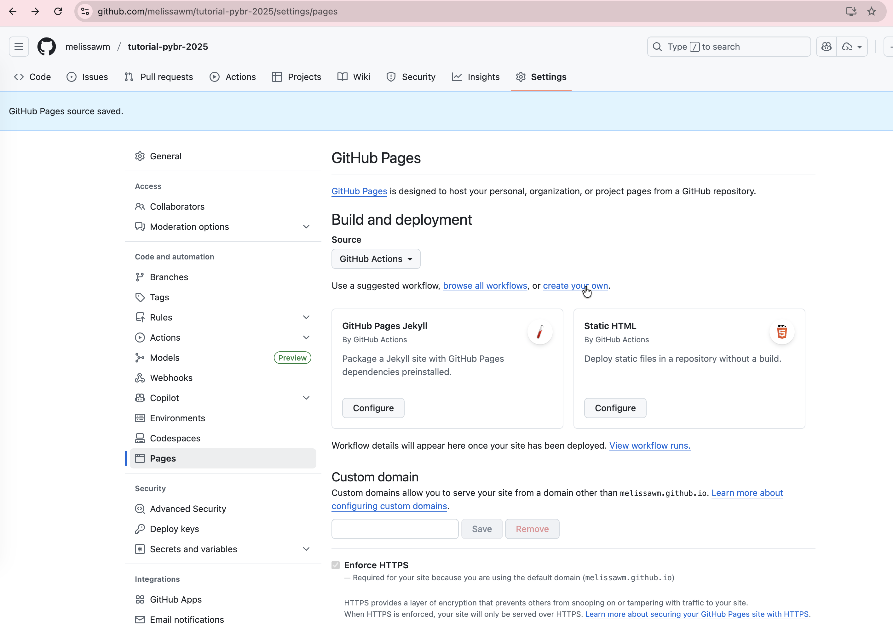

# Publicação

## GitHub Pages

Para publicar sua documentação no GitHub Pages, siga estas etapas:

1. Crie um repositório no GitHub e faça o push do seu código.
2. No repositório, vá para a aba "Settings".

3. Role para baixo até a seção "GitHub Pages" e selecione a opção "GitHub Actions".

4. Selecione a opção "create your own" para criar um novo workflow.

5. Adicione o seguinte conteúdo ao arquivo de workflow:

`````{tab-set}
````{tab-item} Sphinx

```yaml
name: Deploy to GitHub Pages
on:
  push:
    branches:
      - main  # ou a branch que você deseja monitorar
  workflow_dispatch:  # Para executar o workflow manualmente

jobs:
    deploy:
      runs-on: ubuntu-latest
      permissions:
        contents: read
        pages: write
        id-token: write
      steps:
        - uses: actions/checkout@v5
        - name: Setup Pages
          uses: actions/configure-pages@v3
        - name: Install uv
          uses: astral-sh/setup-uv@v6
        - name: "Set up Python"
          uses: actions/setup-python@v5
          with:
            python-version-file: ".python-version"
        - name: Install dependencies
          run: |
              uv sync --all-groups
        - name: Build documentation
          run: |
              uv run make -C docs html
        - name: Upload artifact
          uses: actions/upload-pages-artifact@v3
          with:
            path: './docs/_build/html'
        - name: Deploy to GitHub Pages
          id: deployment
          uses: actions/deploy-pages@v4
```
````

````{tab-item} MkDocs

```yaml
name: Deploy to GitHub Pages
on:
  push:
    branches:
      - main  # ou a branch que você deseja monitorar
  workflow_dispatch:  # Para executar o workflow manualmente

jobs:
    deploy:
      runs-on: ubuntu-latest
      permissions:
        contents: read
        pages: write
        id-token: write
      steps:
        - uses: actions/checkout@v5
        - name: Setup Pages
          uses: actions/configure-pages@v3
        - name: Install uv
          uses: astral-sh/setup-uv@v6
        - name: "Set up Python"
          uses: actions/setup-python@v5
          with:
            python-version-file: ".python-version"
        - name: Install dependencies
          run: |
              uv sync --all-groups
        - name: Build documentation
          run: |
              uv run mkdocs build 
        - name: Upload artifact
          uses: actions/upload-pages-artifact@v3
          with:
            path: './site'
        - name: Deploy to GitHub Pages
          id: deployment
          uses: actions/deploy-pages@v4
```
````
`````

6. Salve e faça o commit do arquivo de workflow.

Se você fizer um push para o branch monitorado (por exemplo, `main`), o GitHub Actions vai executar o workflow automaticamente, mas você também pode executá-lo manualmente na aba "Actions" do seu repositório.

Após alguns minutos, sua documentação estará disponível em `https://<seu-usuario>.github.io/<seu-repositorio>/`.

## ReadTheDocs

Para publicar sua documentação no ReadTheDocs, siga estas etapas:

1. Crie um repositório no GitHub e faça o push do seu código.
2. Acesse [ReadTheDocs](https://readthedocs.org/) e crie uma conta.
3. Após fazer login, clique em "Import a Project".
4. Selecione o repositório que você criou no GitHub.
5. Siga as instruções para configurar o projeto e escolher a branch que contém sua documentação.

O ReadTheDocs pode ser configurado para usar Sphinx ou MkDocs, dependendo de como você estruturou sua documentação. Use o arquivo `.readthedocs.yml` na raiz do seu repositório para especificar as configurações necessárias.

`````{tab-set}
````{tab-item} Sphinx

```yaml
# Read the Docs configuration file for Sphinx projects
# See https://docs.readthedocs.io/en/stable/config-file/v2.html for details

# Required
version: 2

# Set the OS, Python version and other tools you might need
build:
  os: ubuntu-24.04
  tools:
    python: "3.13"
  jobs:
    pre_create_environment:
      - asdf plugin add uv
      - asdf install uv latest
      - asdf global uv latest
    create_environment:
      - uv venv "${READTHEDOCS_VIRTUALENV_PATH}"
    install:
      - UV_PROJECT_ENVIRONMENT="${READTHEDOCS_VIRTUALENV_PATH}" uv sync --frozen --group docs

# Build documentation in the "docs/" directory with Sphinx
sphinx:
  configuration: docs/conf.py
  fail_on_warning: true
```
````

````{tab-item} MkDocs

```yaml
# Read the Docs configuration file for Sphinx projects
# See https://docs.readthedocs.io/en/stable/config-file/v2.html for details

# Required
version: 2

# Set the OS, Python version and other tools you might need
build:
  os: ubuntu-24.04
  tools:
    python: "3.13"
  jobs:
    pre_create_environment:
      - asdf plugin add uv
      - asdf install uv latest
      - asdf global uv latest
    create_environment:
      - uv venv "${READTHEDOCS_VIRTUALENV_PATH}"
    install:
      - UV_PROJECT_ENVIRONMENT="${READTHEDOCS_VIRTUALENV_PATH}" uv sync --frozen --group docs

mkdocs:
  configuration: mkdocs.yml
```
````
`````

Após a configuração, sua documentação será gerada automaticamente e estará disponível em `https://<seu-projeto>.readthedocs.io/`.
